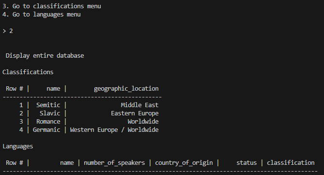

# Language Classifications Menu
Author: Adnan Wazwaz

Version: 1.0

Original Date: 2024 February 6

Current Version Date: 2024 February 6

Adnanian Application #5

## Table of Contents

1. [Overview](#overview)

2. [Installation & Execution](#installation--execution)
    1. [Installation](#installation)
    2. [Execution](#execution)
3. [Usage](#usage)
4. [Future Plans](#future-plans)
5. [Credits](#credits)

## Introduction

Language Classifications Menu is a simple CLI application that allows users to look up a database of languages and language families.
You can see which classification they belong to (such as Semitic, Germanic, Romance, etc.). You can look up how many total speakers
in the world of that language, and even whether that language is still spoken, or has gone extinct. You additionally have the ability
to make changes to the database as you see fit.

The core technologies of this application are <a href="https://www.python.org/downloads/">Python 3.8.13</a> and <a href="https://sqlitebrowser.org/dl/">SQLite3</a>. So if you wish to run this application on your machine, make sure you have both installed on it first. Along with python code comes with one database (language_categories.db), which consists of two tables: classifications and languages. This database represents the one-to-many relationship. A classification has many languages. A language belongs to one classification.

## Installation & Execution

### Installation

The good news is that installing this application is quite easy. This project is saved in my <a href="https://github.com/adnanian/atw-flatiron-cli-project" target="_blank">Flatiron School Phase 3 Project</a>. Please ensure that you have a GitHub account before attempting to install this application onto your local machine. Also ensure that you have Git installed on your local machine as well. If you don't, refer to <a href="https://github.com/git-guides/install-git" target="_blank">this help guide here.</a>

Once you have ensured the above two checks have passed, then all that's left is for you to fork and clone this repository. For those who are not as familiar with GitHub, here is a quick <a href="https://www.geeksforgeeks.org/difference-between-fork-and-clone-in-github/" target="_blank">GeeksForGeeks guide on forking and cloning</a>.

### Execution
To run the project, <b>open up your terminal</b>. Then, navigate to the directory where you have the repository cloned, and open the project. Then, execute the cli.py module by typing <code>python lib/cli.py</code>.

## Usage

When you first run the program, you will receive a welcome message that instructs you how to use this program. This program consists of three menus: the main menu, the classifications menu, and the languages menu.

### Main Menu

The terminal will display a menu of options. This menu is called the main menu. There should be 5 options numbered 0 to 4. You can type one of those numbers to select that option and press ENTER. Once you do, that command will be executed by the program. The options are as follows:

<ol start="0">
    <li>Exit the program - Terminate this program)</li>
    <li>Clear terminal after each command - clear the screen after you select an option number from the menu. If this option is disabled, then executing this command will enable it, and vice versa.</li>
    <li>Display entire database - prints both the classification and language tables to the user.</li>
    <li> Go to classifications menu - exists the main menu and starts displaying the menu of options to work with the classifications table.</li>
    <li> Go to classifications menu - exists the main menu and starts displaying the menu of options to work with the languages table.</li>
</ol>

Below is an example of selecting an option:

If you type an invalid option, you will get an error message saying that.

### Classifications & Languages Menu

There are eight options in these menu. The first one is to exit the program. The second option is to return to the main menu. The third option is to go to the other menu (either classification or language). The other options are as follows:

Options 3 to 6 essentially do the same thing for both menu's, just for their respective models. Note that when navigating to these menus, the tables will be printed to the user, so that you know what you can do with the current values that you have.

### Future Plans
The purpose of this project was to learn how to write my own ORM. And I have succesfully demonstrated the ability to use SQL and Python together, and to use object oriented programming to help create a simple CLI. One day I plan to try Click to learn how to create CLI's with this library.

## Credits
MIT License

Copyright (c) 2023 Adnan Wazwaz

Permission is hereby granted, free of charge, to any person obtaining a copy of this software and associated documentation files (the "Software"), to deal in the Software without restriction, including without limitation the rights to use, copy, modify, merge, publish, distribute, sublicense, and/or sell copies of the Software, and to permit persons to whom the Software is furnished to do so, subject to the following conditions:

The above copyright notice and this permission notice shall be included in all copies or substantial portions of the Software.

THE SOFTWARE IS PROVIDED "AS IS", WITHOUT WARRANTY OF ANY KIND, EXPRESS OR IMPLIED, INCLUDING BUT NOT LIMITED TO THE WARRANTIES OF MERCHANTABILITY, FITNESS FOR A PARTICULAR PURPOSE AND NONINFRINGEMENT. IN NO EVENT SHALL THE AUTHORS OR COPYRIGHT HOLDERS BE LIABLE FOR ANY CLAIM, DAMAGES OR OTHER LIABILITY, WHETHER IN AN ACTION OF CONTRACT, TORT OR OTHERWISE, ARISING FROM, OUT OF OR IN CONNECTION WITH THE SOFTWARE OR THE USE OR OTHER DEALINGS IN THE SOFTWARE.